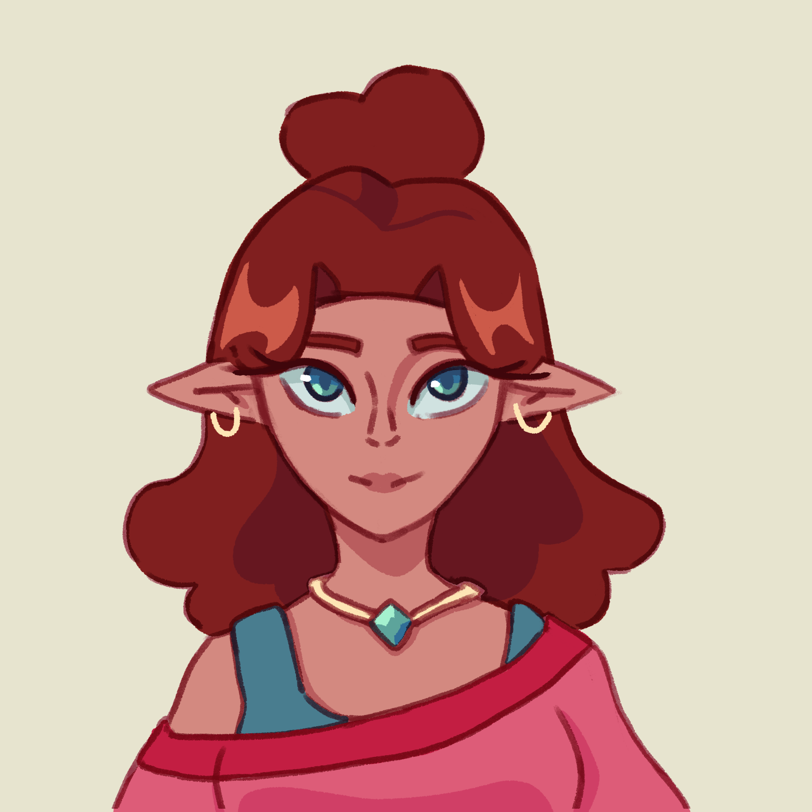

# Characters

## Players
#### Cassius Callahan

#### Ciria Manchester
A thin, shy, akward Half-elf with pale skin, long messy blond hair, soft brown eyes, and braces on her sharp teeth that are a birth defect. Exploring the world of anime and adventure, trying to find her place in her new environment. Never seen without her bass or electric guitar, usually bass. She adores her pet basilisk, Jyura. 
#### Elizabeth Von Ekenberg

#### Murphy Dropkick
A spindly little Triton devil. Skinny, sickly blue skin and big yellow eyes. Scheming of a way to get out of poverty and explore the world. The only thing that keeps him still going to this school is his father and his friends.

#### Revil

#### Seren Stonebreaker

## Family
### Callahans

#### Glorbus
He’s just a little guy. Refers to Cassius as Master. Speaks robotically.

#### Alexander Callahan
Cassius Callahan’s military obsessed uncle. 

#### Anton Callahan
Cassius’s cousin and Alexander Callahan’s adopted son. Sophomore at the Asari Adventuring Academy.

### Manchesters

#### Eliza Manchester
Human
Kind, but thinks that anime is for kids and this is probably just a phase. Concerned that Ciria isn’t maturing, so tries her best to take her to museums and other educational places in Ciria’s freetime, usually as a family bonding activity. Teacher at a regular high school.

#### Rinth Manchester
Astral elf
Kind, but also confused about the whole anime thing. Runs a pottery studio which he hopes one of his kids will take over one day. VERY Autistic. 

#### Kyro Manchester
Middle school aged brother who thinks anime is cringe. 

### Von Ekenberg
#### William Von Ekenberg
Elizabeth’s adopted kobold brother, roughly middle school aged, who is the only one who questions Elizabeth’s antics. He is impulsive, slightly clueless, rebellious, and stubborn. He is a completely average teenager who wants to be a rock star without caring for the logistics of being a rock star.

#### Elise Von Ekenberg
Elizabeth’s human mother is timid and tries to be supportive, but ultimately can’t keep up with Elizabeth’s antics. She often chalks up Elizabeth’s behavior as normal highschooler things. She has long dark hair which she braids into one long braid, and she regularly puts flowers into her braid. She is a gardener but not a druid, tending to her gorgeous front lawn and large backyard garden.

#### Raymond Von Ekenberg
Elizabeth’s human father, who much like her mother, is timid, supportive, but ultimately out of his depth and misunderstands her behavior. He is a very posh man who doesn’t really understand money, since he inherited all of his. However, he is a very loving father who will buy anything his dear children ask for. 

### Monks

#### Nyvorlas Glaeth
High elven Monk
Gilear energy. The one taking care of Murphy. The most pathetic man you can imagine. Not very dexterous or strong. Kind of sad and pathetic. He cares though.

#### Martin Flaren
Human monk
Murphy’s other adoptive dad. Currently staying at the Suncreek temple on the outskirts of town. Generally very strict, though he tries to be understanding.

#### Stillwater Apartment #11
Given a short amount of time to find a new place for Murphy after he got kicked out, and with very little funds due to their lifestyle, Martin and Nyvorlas had to take what they could find. It’s a small dingy apartment. 

### Linseed

#### Mara Linseed
Human Druid Circle of Dreams
The human host-mother of Revil. She and her wife host exchange students regularly and take delight in teaching them about Solace and providing them a home. In her freetime, she bakes and owns a small bakery. She’s a wholesome hippie who takes pride in helping raise her exchange students.

#### Pearl Linseed
Sea Elf Fey Wanderer Ranger
Pearl is the other host mother of Revil. She originates from a lagoon in the feywild, where she lived with many fey fish-like creatures. She has a large pet fey axolotl thing named Coral which has dragonfly wings. 

#### Linseed Treehouse
A multilayered wooden house built around and in the branches of a tall ancient oak tree. There is a large lake nearby which they call their pool.

### Stonebreakers

#### Kevin Stonebreaker
Goliath barbarian. Wears a blonde toupee and is transphobic. Famed adventurer (just called The Stonebreaker), now retired. Gruff man who has so much toxic masculinity. Really cares about his daughter Seren, but refers to her as a strong young man and as Lucian.

#### Novak Rivercarver
Goliath Circle of Stars Druid
Biomom of Em’s character. A strong, goliath woman who mysteriously disappeared shortly after Seren was born. She had to leave Suncreek to go to the edges of Solace to help defend her clan, and hasn’t returned since, leaving Kevin to presume her dead. 
She has constellation tattoos and her eyes have galaxies inside them. Her hair is very long, but it is braided and tied up into a very tight bun.

#### Violet Stonebreaker
Step-mom of Seren. A sweet and caring drow woman who has taken the role of mother in Seren’s life. She has dark deep purple skin and with similar natural hair at the roots and dyed bright purple at the tips. She’s big into yoga and meditation. Violet is a physical therapist, so while fit, she’s never been an adventurer.

#### Ayla Stonebreaker
The middle school aged step-sister of Seren, Ayla is an unusually strong and tall dark elf who loves gymnastics. She looks up to her older sister but is remarkably shy, barely talking to anyone but her closest friends and her parents.

## Students
#### Vanessa Faren
{width=200; align=left}
Vanessa Faren is a half-elf bard who is generally the popular girl of the school.
 
 
 
 
 
 
 

#### Popular Bugbear

#### Vitalyn Orianna

#### Arialion Ovayath (Aria)

#### Lily Lunalin

#### Skye Ragathorn
Orc artificer who does dawnmoss and duskmoss behind the school with her friends [Lily Lunalin](#lily-lunalin) and [Arabella Miso](#arabella-miso).

#### Arabella Miso

#### Wimwarith Yelogor

#### Heras Lymphasia

#### Parker Ragendass
Sports betting wizard. Dwarf.

#### Wagua Wawa
Sea elf. Kind of a cryptid.

#### Lee Toughbark
Gnomish artificer that fully fits the stereotype of a typical gnomish tinkerer. Dark brown braided hair and green eyes.

## School Staff
#### Principal Gimo Asari Dumpsterdive
Are they a wizard? druid? sorcerer? who the fuck knows! resident insane guy. He’s a raccoon man that uses all pronouns. Fuck you.

#### Vice Principal Amy Greenwitch
Vice principal and sort of a paladin but not that great at it. Much better at all the administrative work. Very stern.

#### Doctor Bork Nork the Science Orc
Artificer teacher with walenta energy and a love of explosives. Streak of white hair and vitiligo. Hair in a bun with one strand hanging out on her left side. Prefers to be called Doctor Nork. PhD in explosives. Co-advisor of [Robotics Club](groups.md/#robotics-club).

#### Professor Willowpool
Tabaxi wizard teacher. Crystal and trinket girlie. Divination wizard obsessed with magical artifacts, wearing so many gems and bracelets and ear cuffs and necklaces and and and. Kinda crazy. Co-advisor of [Robotics Club](groups.md/#robotics-club).

#### Jacquis Blakely
Halfling monk teacher with two braids in the front and an afro, each ear pierced with a stud. Chill ass dude who does not tolerate unnecessary violence. 

#### Rax Zilyn
Goblin barbarian teacher with diamond shaped irises and a long wolf cut. Small but full of rage. Fuck you.

#### Aspen Wolafeth
Half-elf circle of the moon druid teacher. Genderfluid. Advisor of [GSA Club](groups.md/#gsa-club).

#### Cleos Eclipsis
Dreugar echo knight fighter teacher

#### Professor Wesley Woradin
High elf College of lore bard teacher: also the english and history teacher. Really traditional and boring as hell. Advisor of [Band]().

#### Coach Yellowtail
Triton. Dead and a creep, according to [Lily Lunalin](#lily-lunalin).

## Misc
#### Nakgren Ashjaw
A tired dwarf who works at 7/11.
